# Zotero同步设置
Zotero多端同步主要通过坚果云进行多端同步：Windows（含Mac）端可使用坚果云插件同步；Linux端与ios则需要通过WebDAV进行配置。

## 同步背景
Zotero附件采用的同步方式为坚果云WebDAV或插件同步；Zotero插件采用的同步方式是坚果云同步到多端特定文件夹，手动加载插件。

Zotero的附件同步需要在**顶部菜单栏-edit-setting**里，选择**同步-文件同步**，登陆账户，而后选择文件同步方式为WebDAV，不勾选使用Zotero同步。

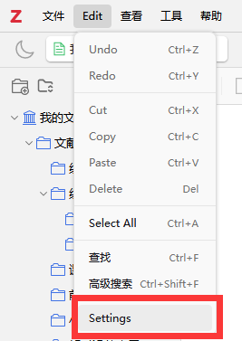
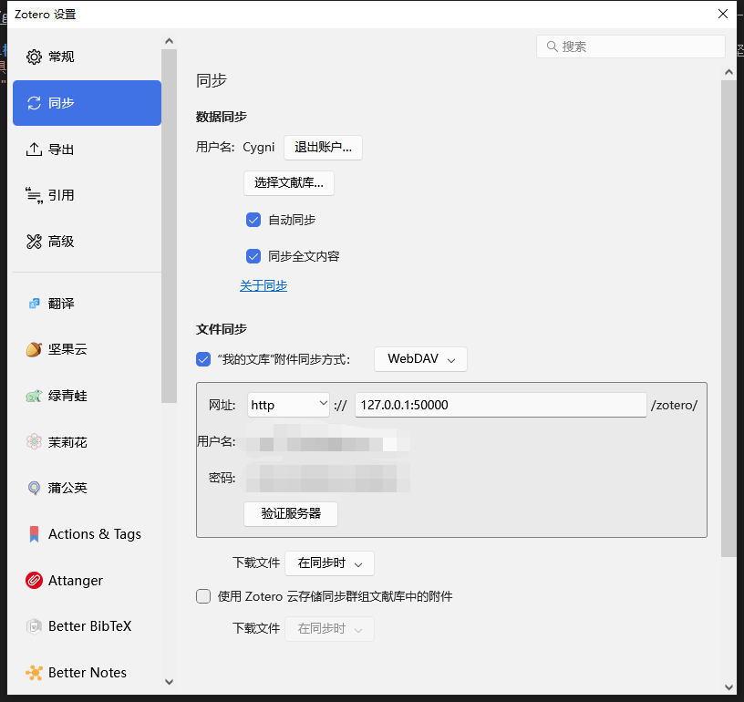

## Zotero附件同步
### 坚果云插件同步设置
在Windows系统下的坚果云同步比较简单，打开坚果云左侧菜单里的**Zotero同步插件**，坚果云会自动下载安装插件；

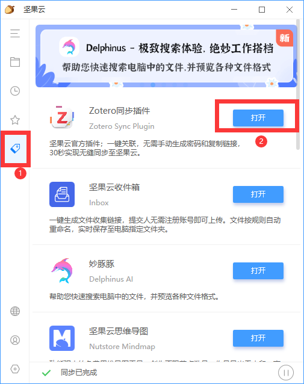

在下载完成后，在Zotero的**顶部菜单栏-edit-setting**里，选择坚果云插件，点击验证坚果云服务即可完成同步。

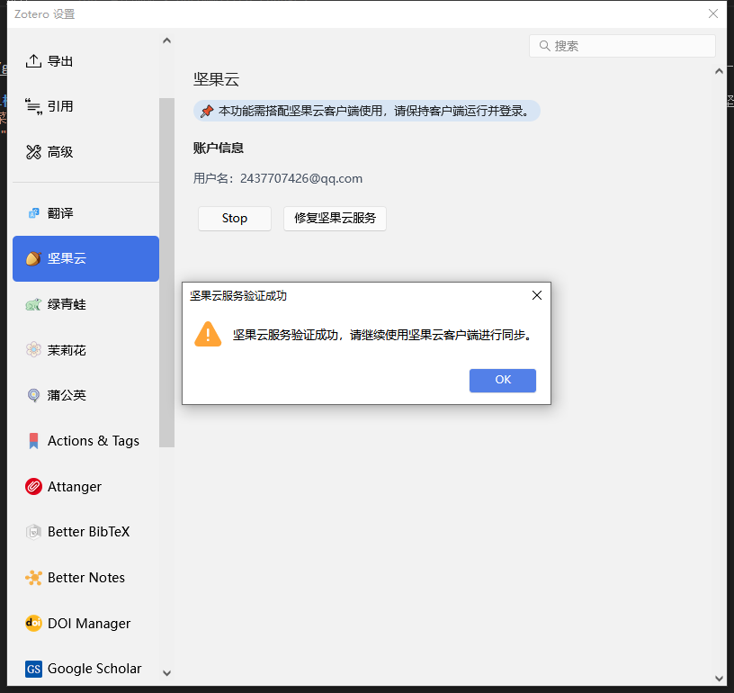

### WebDAV同步设置
在Linux系统上进行同步则需要进行稍多一些操作，打开[坚果云官网](https://www.jianguoyun.com/)并登陆后，在右上角打开**账户信息**，点击进入**安全选项**后，选择**添加应用**获取应用密码用于后续同步。

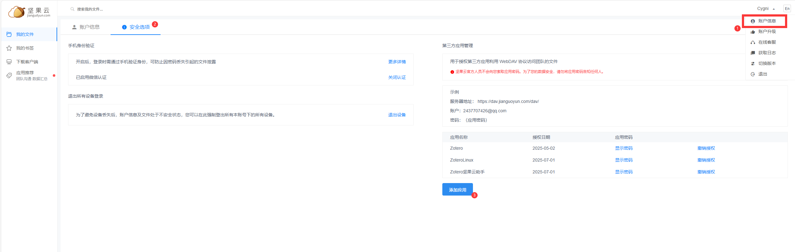

在获取密码以后，在**顶部菜单栏-edit-setting**里，在**同步-文件同步**，选择同步方式为**WebDAV**，并填写网址为：

> dav.jianguoyun.com/dav

后续密码为先前获取的应用密码，在验证服务器以后即可同步。

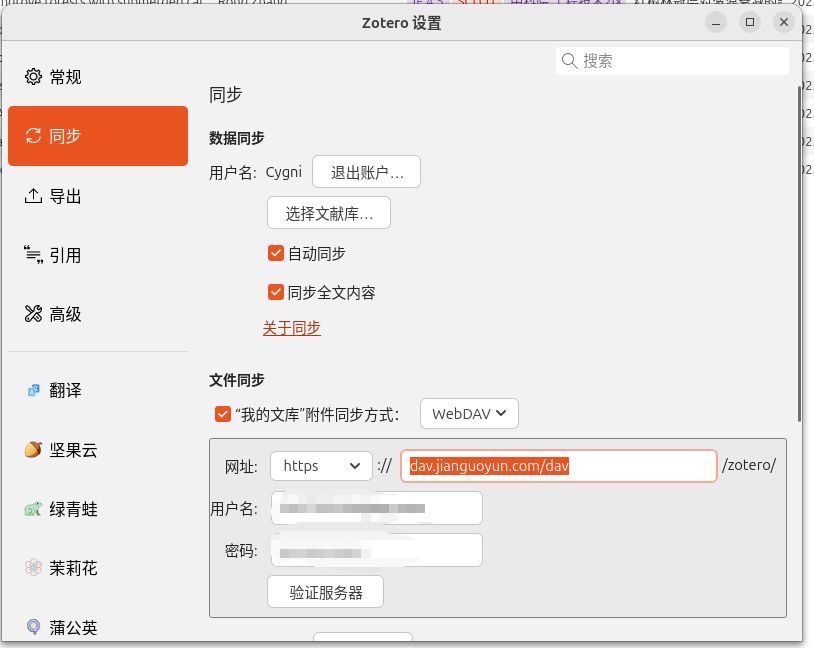

## Zotero插件、格式、转换器同步（by [蒲公英插件](https://github.com/l0o0/tara/releases/download/v1.0.7/tara.xpi)）
首先通过[Zotero插件市场插件](https://github.com/syt2/zotero-addons/releases/download/V2.1.1/zotero-addons.xpi)、[Zotero社区插件市场](https://zotero-chinese.com/plugins/)或[本文蒲公英连接链接](https://github.com/l0o0/tara/releases/download/v1.0.7/tara.xpi)下载得到蒲公英插件后，在Zotero的**顶部菜单栏-工具-plugins**中，在右上角**设置-Install Plugin from files**导入蒲公英插件。

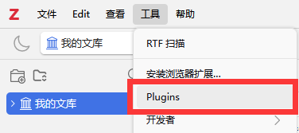
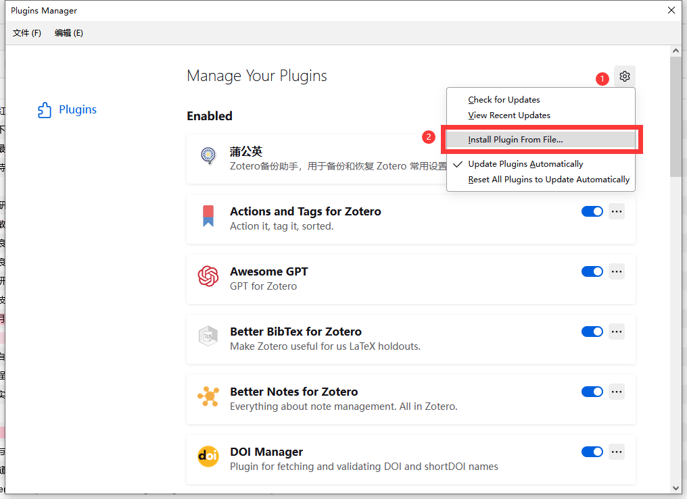

在导入完成插件后，在Zotero的**顶部菜单栏-工具-蒲公英**可以对目前Zotero的插件、格式、转换器进行创建备份、导入导出备份与恢复备份。

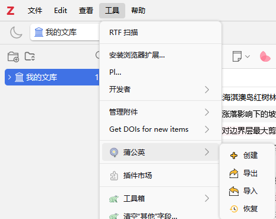

在完成备份之后，备份文件会在**zotero/storage**文件夹内，并随着坚果云实现多端同步备份文件，在其他端找到备份文件进行导入即可实现多端同步插件、格式、转换器。

~~## Zotero插件同步（手动）~~ 手动同步方法现不推荐
本文采用的Zotero插件管理是通过[Zotero 插件市场](https://github.com/syt2/zotero-addons/releases/download/V2.1.1/zotero-addons.xpi)这一插件进行安装管理，同时也利用这一插件进行插件同步。

具体同步时，在已安装Zotero插件市场的前提下，在**顶部菜单栏-工具-插件市场**打开插件市场，随后**右键-在文件管理器中打开**打开文件资源管理器，将整个extension文件夹同步到坚果云。

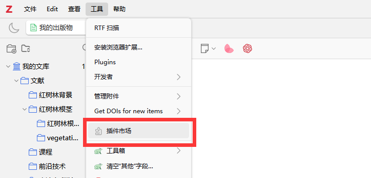
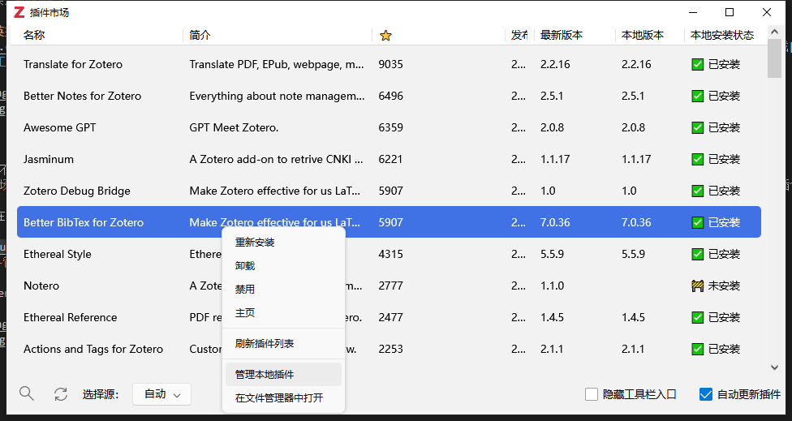

通过坚果云将extension文件夹多端同步后，在Zotero的**顶部菜单栏-工具-plugins**中，在右上角**设置-Install Plugin from files**导入extension文件夹内的插件。

