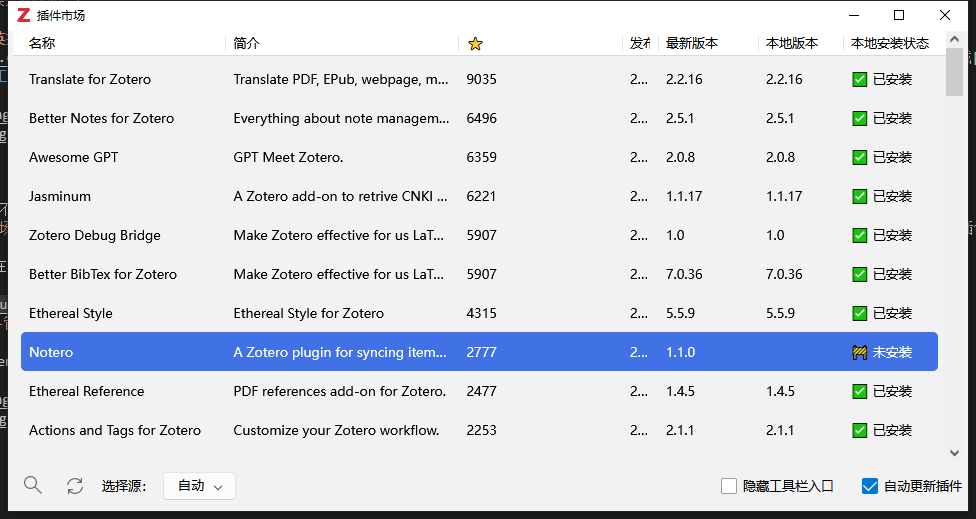

# Zotero插件设置
Zotero生态下有许多功能丰富的插件，本文主要介绍在Zotero7下使用的一些插件。

## 本人使用的插件与写作记录进度，附带Github连接：
- [x] [蒲公英](https://github.com/l0o0/tara/releases/download/v1.0.7/tara.xpi)
- [ ] [Actions and Tags for Zotero](https://github.com/windingwind/zotero-actions-tags/releases/download/v2.1.1/actions-and-tags-for-zotero.xpi)
- [ ] [Awesome GPT](https://gitee.com/MuiseDestiny/plugins/raw/master/zotero-gpt.xpi)
- [ ] [Better BibTex for Zotero](https://github.com/retorquere/zotero-better-bibtex/releases/download/v7.0.36/zotero-better-bibtex-7.0.36.xpi)
- [ ] [Better Notes for Zotero](https://github.com/windingwind/zotero-better-notes/releases/download/v2.5.1/better-notes-for-zotero.xpi)
- [ ] [DOI Manager](https://github.com/bwiernik/zotero-shortdoi/releases/download/v1.5.0/zotero-doi-manager-1.5.0.xpi)
- [ ] [Easier Citation](https://github.com/MuiseDestiny/zotero-citation/releases/download/0.5.0/zotero-citation.xpi)
- [ ] [Ethereal Reference](https://gitee.com/MuiseDestiny/plugins/raw/master/zotero-reference.xpi)
- [ ] [Ethereal Style](https://gitee.com/MuiseDestiny/plugins/raw/master/zotero-style.xpi)
- [ ] [Google Scholar Citation Count](https://github.com/justinribeiro/zotero-google-scholar-citation-count/releases/download/v4.3.0/zotero-google-scholar-citation-count-4.3.0.xpi)
- [ ] [Green Frog](https://github.com/redleafnew/zotero-updateifsE/releases/download/v0.20.2/green-frog.xpi)
- [ ] [Jasminum](https://github.com/l0o0/jasminum/releases/download/v1.1.17/jasminum_1.1.17.xpi)
- [ ] [Linter for Zotero](https://github.com/northword/zotero-format-metadata/releases/download/v1.24.5/linter-for-zotero.xpi)
- [ ] [Nutstore](https://github.com/nutstore/zotero-plugin-nutstore/releases/download/v2.0.2/nutstore.xpi)
- [ ] [PDF Figure](https://github.com/MuiseDestiny/zotero-figure/releases/download/0.2.6/zotero-figure.xpi)
- [ ] [Sci-PDF](https://github.com/syt2/zotero-scipdf/releases/download/V1.3.0/sci-pdf.xpi)
- [ ] [Translate for Zotero](https://github.com/windingwind/zotero-pdf-translate/releases/download/v2.2.16/translate-for-zotero.xpi)
- [ ] [Zotero 插件市场](https://github.com/syt2/zotero-addons/releases/download/V2.1.1/zotero-addons.xpi)
- [ ] [Zotero Attanger](https://github.com/MuiseDestiny/zotero-attanger/releases/download/1.3.5/zotero-attanger.xpi)
- [ ] [Zotero Debug Bridge](https://github.com/retorquere/zotero-better-bibtex/releases/download/debug-bridge/debug-bridge-1.0.xpi)
- [ ] [Zotero OCR](https://github.com/UB-Mannheim/zotero-ocr/releases/download/0.9.2/zotero-ocr-0.9.2.xpi)
- [ ] [ZotMoov](https://github.com/wileyyugioh/zotmoov/releases/download/1.2.21/zotmoov-1.2.21-fx.xpi)

### 导入插件的方法
1.通过[Zotero社区插件市场](https://zotero-chinese.com/plugins/)下载插件

通过[Zotero社区插件市场](https://zotero-chinese.com/plugins/)下载得到插件后，在Zotero的**顶部菜单栏-工具-plugins**中，在右上角**设置-Install Plugin from files**导入插件。

2.通过[Zotero 市场插件](https://github.com/syt2/zotero-addons/releases/download/V2.1.1/zotero-addons.xpi)下载管理插件（推荐）

可以先在[Zotero社区插件市场](https://zotero-chinese.com/plugins/)下载[Zotero 市场插件](https://github.com/syt2/zotero-addons/releases/download/V2.1.1/zotero-addons.xpi)。通过上面的方法安装好市场插件后，便可以利用此插件进行下载管理插件.

## [蒲公英](https://github.com/l0o0/tara/releases/download/v1.0.7/tara.xpi)
蒲公英插件是一款实现备份Zotero插件、CSL文件、转换器文件、Locate文件夹和Zotero配置的插件。

### 使用方法
在导入完成蒲公英插件后，在Zotero的**顶部菜单栏-工具-蒲公英**可以对目前Zotero的插件、格式、转换器进行创建备份、导入导出备份与恢复备份。

在完成备份之后，备份文件会在**zotero/storage**文件夹内，并随着坚果云实现多端同步备份文件，在其他端找到备份文件进行导入即可实现多端同步插件、格式、转换器。

## [坚果云插件](https://github.com/nutstore/zotero-plugin-nutstore/releases/download/v2.0.2/nutstore.xpi)
坚果云插件